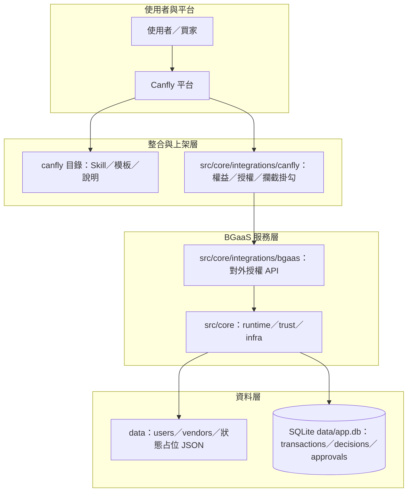
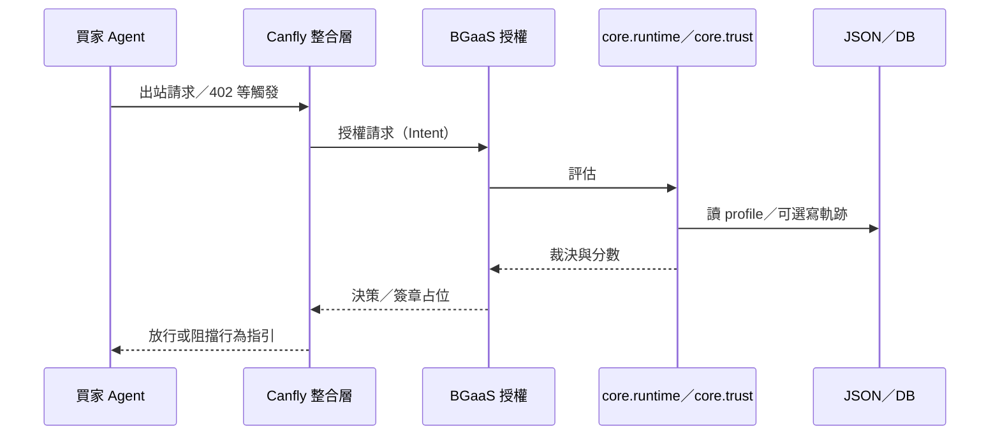
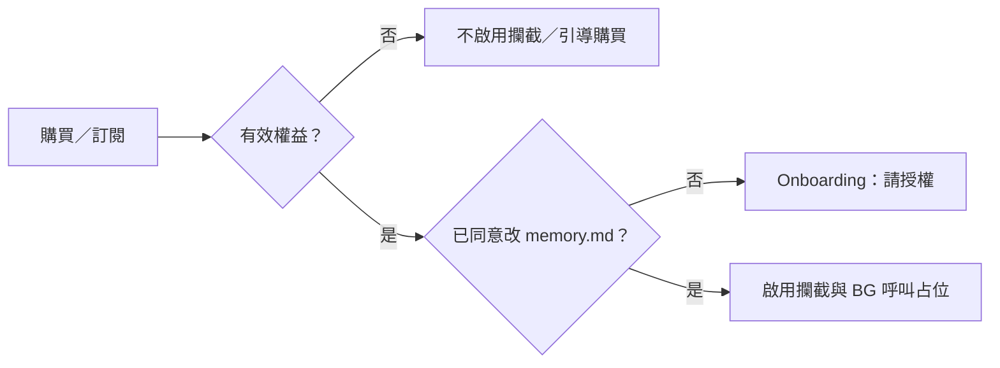

# Budget Guardian

買家 Agent 的預算與付款治理：**Canfly**與 **Smart Account** 為兩條並行路線；決策核心共用。

本檔為專案**唯一說明入口**（架構、目錄、Canfly 上架資產皆在此）。

---

## 安裝與本機指令

```text
pip install -e .
python -m core.infra.init_db
python -m core.main
python -m core.main transactions/transaction1.json
```

不帶參數時會使用 `transactions/transaction1.json`。

```text
# BGaaS HTTP（另開終端）
copy .env.example .env
python -m core.integrations.bgaas.http_stub

# 核准流程
python -m core.approve <transaction_id> approve
python -m core.integrations.bgaas.authorize_cli transactions/transaction4.json --after-approval --tx-id <transaction_id>

# Canfly demo（需 BG HTTP 已啟動）
python scripts/canfly_demo.py

python -m core.admin
```

對外常用匯入範例：`from core.trust import make_decision, evaluate_trust_score`；`from core import process_transaction`、`authorize_payment_intent`。

---

## 專題進度

| 項目 | 狀態 |
|------|------|
| 信任分數 + 裁決 + CLI + SQLite | 完成 |
| BGaaS `POST /authorize`、`/verify`、`/health` | 完成 |
| EIP-712 簽章（ALLOW/ANNOUNCE；REQUIRE_APPROVAL 不簽可付款 token） | 完成 |
| 核准 CLI `core.approve` + 核准後再授權 | 完成 |
| Canfly state / pipeline / preflight HTTP | 完成 |
| Smart Account plugin | Phase 7 占位（`core.integrations.smart_account`） |

---

## Agent Payment Authorization Protocol（摘要）

### Payment Intent（Agent → BG）

與 `transactions/*.json` 欄位一致：

| 欄位 | 說明 |
|------|------|
| `service_id` | 服務識別 |
| `amount_usd` | 金額（> 0） |
| `receiver_address` | 收款地址（可缺，觸發風險 flag） |
| `payment_reason` | 說明 |

`POST /authorize` body：

```json
{
  "user_id": "user_001",
  "vendor_id": "vendor_001",
  "intent": { "service_id": "...", "amount_usd": 0.8, "receiver_address": "0x...", "payment_reason": "..." },
  "force_after_approval": false
}
```

### Authorization Response（BG → Agent / Provider）

| 欄位 | 說明 |
|------|------|
| `decision` | ALLOW / ANNOUNCE / REQUIRE_APPROVAL / DENY |
| `trust_score` | 0–100 |
| `signature` | EIP-712 hex（僅 ALLOW、ANNOUNCE；或核准後再授權的 ALLOW） |
| `transaction_id` | 審計用 ID |
| `deadline` | Unix 秒 |
| `signer_address` | BG 簽章者地址 |

### HTTP 402（demo）

`POST /mock-402` 回傳模擬 402 與 `WWW-Authenticate` header，Agent 應改打 `POST /authorize`。

### 驗簽（Provider）

`POST /verify` body：`transaction_id`, `decision`, `trust_score`, `deadline`, `signature` → `{ "valid": true/false }`。

簽章環境變數見 [`.env.example`](.env.example)。

---

## 專題定位與邊界

**定位**：服務 **買家 Agent**，在付款或付費 API 呼叫前做 **風險治理與預算授權**。

**兩條並行路線**：


| 路線                           | 攔截發生在哪裡                        | 強制程度                        |
| ---------------------------- | ------------------------------ | --------------------------- |
| **A：Canfly 服務**              | Agent 執行環境／Skill／記憶與 HTTP 行為約定 | 依賴 Agent 遵守流程；適合 demo 與產品敘事 |
| **B：Smart Account + Plugin** | 出金／UserOperation 驗證前           | 較接近「沒過檢查就不能付」（仍須金鑰治理配合）     |


**共用核心**：同一套 **政策輸入（使用者／賣家屬性）** → **信任與預算評估** → **裁決（ALLOW 等）** → （可選）**簽章與審計紀錄**。

---

## 三塊模型（Onboarding／攔截／信任）


| 區塊             | 做什麼                       | 程式大致落點                                             |
| -------------- | ------------------------- | -------------------------------------------------- |
| **Onboarding** | 首次購買／啟用、是否同意改 `memory.md` | `core.integrations.canfly.onboarding`、權益占位         |
| **攔截**         | 出站 HTTP／付費前先諮詢 BG         | `core.integrations.canfly.interception`、`pipeline` |
| **信任**         | 讀規則與 profile → 評分 → 裁決    | `core.trust`、`core.runtime` 編排                     |


---

## 分層




**說明**：

- **整合與上架層**：只管「誰買過」「能不能改 memory」「要不要開攔截」，不接細節評分公式。
- **BGaaS 服務層**：對外提供「這筆付款意圖能不能過」；內部呼叫評分與裁決。
- **資料層**：JSON 多半是 **規則與主資料占位**；SQLite 多半是 **請求與裁決軌跡**（審計、核准流程）。

---

## 目錄與責任對照

### 根目錄


| 路徑            | 責任                                                     |
| ------------- | ------------------------------------------------------ |
| **README.md** | 專案說明、架構、Canfly 上架與開發指引                                 |
| **canfly/**   | **上架用**：Skill 說明、`memory.md` 注入範本、給 Canfly 打包／審核看的文字資產 |
| **data/**     | **靜態或占位資料**：使用者／賣家 profile、Canfly 權益占位檔                |
| **src/**      | **Python 套件根**：可安裝套件 `core`（見 **pyproject.toml**）      |


### `canfly/`（上架資產）


| 路徑                    | 責任                                             |
| --------------------- | ---------------------------------------------- |
| **canfly/README.md**  | 捷徑：導回本檔 Canfly 一節                              |
| **canfly/skill/**     | Skill 描述、之後接官方要求的 manifest／結構                  |
| **canfly/templates/** | 使用者同意後欲寫入 `memory.md` 的**範本內容**（規範 Agent 行為敘述） |


### `src/core/integrations/canfly/`（Canfly 端流程骨架）


| 模組概念             | 責任                                  |
| ---------------- | ----------------------------------- |
| **config**       | 服務名稱、記憶檔名、BG 基底 URL 等常數占位           |
| **models**       | 權益、md 授權、gate 結果等**狀態形狀**（契約）       |
| **entitlement**  | 是否已購買／訂閱本服務（之後接 billing 或後端）        |
| **onboarding**   | **首次**：請使用者授權修改 `memory.md`；同意後套用模板 |
| **interception** | 對外 HTTP／付費前的**掛勾占位**（何時要先問 BG）      |
| **pipeline**     | 串起：**權益 → md 同意 → 是否啟用攔截與 BG 呼叫**   |


### `src/core/integrations/bgaas/`（對外 BGaaS）


| 模組概念          | 責任                                                            |
| ------------- | ------------------------------------------------------------- |
| **types**     | Payment Intent／Authorization Response 等**協定資料形狀**占位           |
| **authorize** | **授權決策入口**：內部應呼叫 `**core.runtime.process_transaction`**，並預留簽章 |
| **http_stub** | 日後 HTTP 伺服器綁路由的占位（例如 REST POST）                               |


### `src/core/`（交易編排）與 `src/core/trust/`（信任模組）

**交易編排（`core` 根目錄）**


| 檔案／模組          | 責任                                                                                                                            |
| -------------- | ----------------------------------------------------------------------------------------------------------------------------- |
| **main.py**    | 啟動程式：建立或接收 `**transaction`**，呼叫 `**runtime.process_transaction**`                                                             |
| **runtime.py** | **process_transaction**：`**infra.data_loader`** → `**core.trust.make_decision**` → `**infra.db**` → `**infra.notifications**` |


**底層設施** `core.infra`


| 檔案                         | 責任                                       |
| -------------------------- | ---------------------------------------- |
| **infra/paths.py**         | **PROJECT_ROOT／DATA_DIR**                |
| **infra/data_loader.py**   | 讀 **users.json／vendors.json**            |
| **infra/db.py**            | SQLite **data/app.db** 寫入                |
| **infra/init_db.py**       | 建表；執行 `**python -m core.infra.init_db`** |
| **infra/notifications.py** | 依裁決寄通知／更新狀態（占位）                          |


**信任與裁決 `core.trust`**


| 檔案                       | 責任                                                 |
| ------------------------ | -------------------------------------------------- |
| **trust/trust_score.py** | 黑名單、四分數與加權公式、**risk_flags**、`evaluate_trust_score` |
| **trust/decision.py**    | 門檻裁決 ALLOW／ANNOUNCE／REQUIRE_APPROVAL／DENY          |
| **trust/init.py**        | 對外匯出常用符號                                           |


**與 runtime 的關係**：`process_transaction` 透過 `**core.trust.make_decision`** 取得裁決；其餘透過 `**core.infra**` 讀 JSON、寫 SQLite、呼叫 `**infra.notifications.apply_decision_side_effects**`。

---

## Canfly 上架資產說明

**程式邏輯**在 `**src/core/`**（套件 `**core**`），尤其是 `**core.integrations.canfly**`。  
`**canfly/**` 目錄放的是給 **Canfly 平台格式**用的文案與模板（Skill、`memory.md` 注入範本等），方便上架／審核與打包；與「Python 套件說明」分開較清楚。

### 預期流程

1. 使用者在 Canfly **購買／啟用** Budget Guardian。
2. **首次**：請使用者授權是否允許修改 `memory.md`（見 `canfly/templates/`）。
3. **已購買且已授權**：由 `**core.integrations.canfly`** 的 pipeline 掛 **HTTP／付費攔截** 與 **BG API**（實作 TODO）。

### `canfly/` 子路徑速查


| 路徑                                                 | 用途                              |
| -------------------------------------------------- | ------------------------------- |
| `canfly/skill/SKILL.md`                            | Skill 簡介與行為說明（佔位）               |
| `canfly/templates/memory_injection_placeholder.md` | consent 通過後欲寫入 memory 的片段範本（佔位） |


實際欄位名稱與打包方式以 Canfly 官方文件為準。

---

## 資料存放（JSON vs SQLite）


| 存放處                               | 典型內容                             | 用途                            |
| --------------------------------- | -------------------------------- | ----------------------------- |
| **users.json／vendors.json**       | 預算、名單、賣家聲譽與價格合理區間等               | **評分輸入**、demo 資料              |
| **canfly_placeholder_state.json** | 購買與 md 授權占位結構                    | **整合層狀態**占位，之後可換成真 billing／後端 |
| **SQLite（data/app.db）**           | transactions／decisions／approvals | **事件與裁決軌跡**、日後核准流程與報表         |


原則：**JSON 偏「身分與規則快照」**，**SQLite 偏「發生過什麼」**。

---

## 端到端資料流

### 買家發起付費意圖 → BG 裁決




### Canfly 首次購買與啟用（軟治理）




---

## 裁決語意（與對外行銷／協定對齊）


| 輸出                   | 意義（概念）               |
| -------------------- | -------------------- |
| **ALLOW**            | 在政策與信任下可直接放行（簽章策略另訂） |
| **ANNOUNCE**         | 需對使用者明示（通知／紀錄）       |
| **REQUIRE_APPROVAL** | 需人類或其他因子核准後才可放行      |
| **DENY**             | 不通過；不提供核准            |


細節門檻見上文 **Protocol** 與 [`src/core/integrations/bgaas/eip712.py`](src/core/integrations/bgaas/eip712.py)。