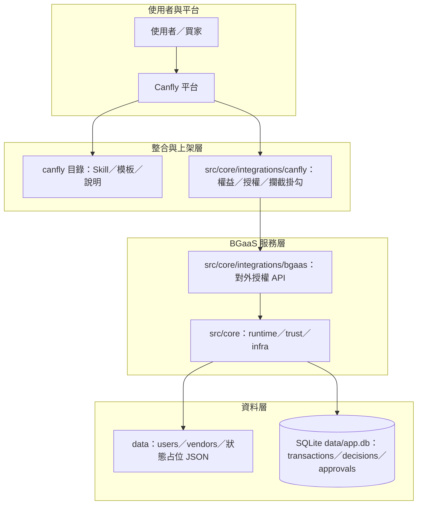
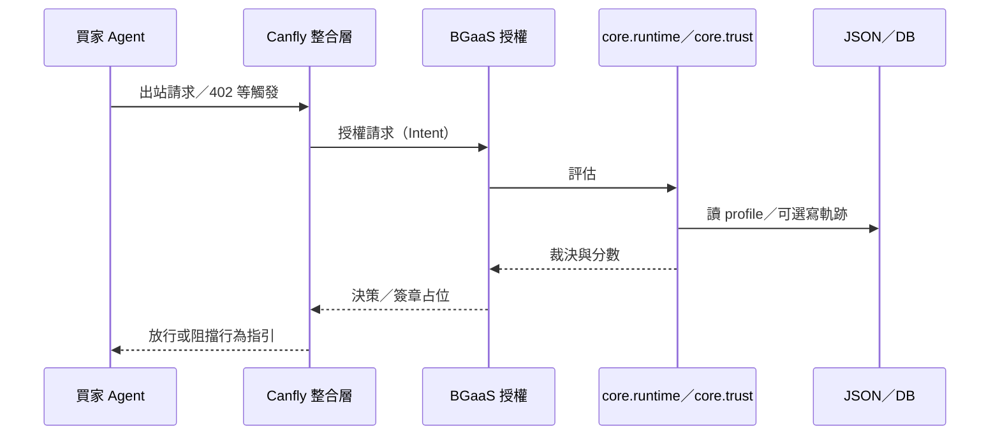
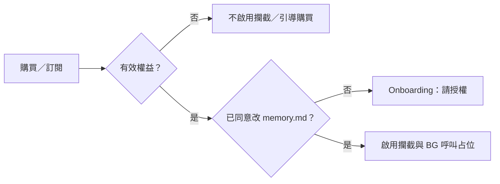

# Budget Guardian — 系統架構說明

本文件描述專題的**邏輯架構**、**模組責任**與**資料流**，不包含實作程式碼。

---

## 1. 文件目的

讓組員與評審能快速對齊：

- 買家 Agent 預算治理要解決什麼問題  
- **軟攔截（Canfly）**與**硬攔截（Smart Account）**各自落在哪一層  
- 現有 repo 裡「評分」「決策」「紀錄」「上架資產」各放在哪裡、彼此如何銜接  

---

## 2. 專題定位與邊界

**定位**：服務 **買家 Agent**，在付款或付費 API 呼叫前做 **風險治理與預算授權**。

**兩條並行路線**（可依時程只做其中一條 MVP）：

| 路線 | 攔截發生在哪裡 | 強制程度（概念上） |
|------|----------------|-------------------|
| **A：Canfly 服務** | Agent 執行環境／Skill／記憶與 HTTP 行為約定 | 依賴 Agent 遵守流程；適合 demo 與產品敘事 |
| **B：Smart Account + Plugin** | 出金／UserOperation 驗證前 | 較接近「沒過檢查就不能付」（仍須金鑰治理配合） |

**共用核心**：同一套 **政策輸入（使用者／賣家屬性）** → **信任與預算評估** → **裁決（ALLOW 等）** → （可選）**簽章與審計紀錄**。

---

## 3. 邏輯分層（由外而內）

**說明**：

- **整合與上架層**：只管「誰買過」「能不能改 memory」「要不要開攔截」，不接細節評分公式。  
- **BGaaS 服務層**：對外提供「這筆付款意圖能不能過」；內部呼叫評分與裁決。  
- **資料層**：JSON 多半是 **規則與主資料占位**；SQLite 多半是 **請求與裁決軌跡**（審計、核准流程）。

---

## 4. 目錄與責任對照

### 4.1 根目錄

| 路徑 | 責任 |
|------|------|
| **docs/** | 架構與協定類文件（含 **CANFLY.md**、本檔與後續 PROTOCOL 等） |
| **canfly/** | **上架用**：Skill 說明、`memory.md` 注入範本、給 Canfly 打包／審核看的文字資產 |
| **data/** | **靜態或占位資料**：使用者／賣家 profile、Canfly 權益占位檔 |
| **src/** | **Python 套件根**：可安裝套件 `core`（見 **pyproject.toml**） |

### 4.2 `canfly/`（上架資產，偏文件與範本）

| 路徑 | 責任 |
|------|------|
| **canfly/README.md** | 精簡導覽；完整流程見 **[CANFLY.md](CANFLY.md)** |
| **canfly/skill/** | Skill 描述、之後接官方要求的 manifest／結構 |
| **canfly/templates/** | 使用者同意後欲寫入 `memory.md` 的**範本內容**（規範 Agent 行為敘述） |

### 4.3 `src/core/integrations/canfly/`（Canfly 端流程骨架）

| 模組概念 | 責任 |
|----------|------|
| **config** | 服務名稱、記憶檔名、BG 基底 URL 等常數占位 |
| **models** | 權益、md 授權、gate 結果等**狀態形狀**（契約） |
| **entitlement** | 是否已購買／訂閱本服務（之後接 billing 或後端） |
| **onboarding** | **首次**：請使用者授權修改 `memory.md`；同意後套用模板 |
| **interception** | 對外 HTTP／付費前的**掛勾占位**（何時要先問 BG） |
| **pipeline** | 串起：**權益 → md 同意 → 是否啟用攔截與 BG 呼叫** |

### 4.4 `src/core/integrations/bgaas/`（對外 BGaaS）

| 模組概念 | 責任 |
|----------|------|
| **types** | Payment Intent／Authorization Response 等**協定資料形狀**占位 |
| **authorize** | **授權決策入口**：內部應呼叫 **`core.runtime.process_transaction`**，並預留簽章 |
| **http_stub** | 日後 HTTP 伺服器綁路由的占位（例如 REST POST） |

### 4.5 `src/core/`（交易編排）與 **`src/core/trust/`**（信任模組）

**交易編排（`core` 根目錄）**

| 檔案／模組 | 責任 |
|------------|------|
| **main.py** | 啟動程式：建立或接收 **`transaction`**，呼叫 **`runtime.process_transaction`** |
| **runtime.py** | **process_transaction**：**`infra.data_loader`** → **`core.trust.make_decision`** → **`infra.db`** → **`infra.notifications`** |

**底層設施（子套件 `core.infra`，集中路徑／資料／SQLite／通知占位）**

| 檔案 | 責任 |
|------|------|
| **infra/paths.py** | **PROJECT_ROOT／DATA_DIR** |
| **infra/data_loader.py** | 讀 **users.json／vendors.json** |
| **infra/db.py** | SQLite **data/app.db** 寫入 |
| **infra/init_db.py** | 建表；執行 **`python -m core.infra.init_db`** |
| **infra/notifications.py** | 依裁決寄通知／更新狀態（占位） |

**信任與裁決（獨立子套件 `core.trust`）**

| 檔案 | 責任 |
|------|------|
| **trust/trust_score.py** | 黑名單、四分數與加權公式、**risk_flags**、`evaluate_trust_score` |
| **trust/decision.py** | 門檻裁決 ALLOW／ANNOUNCE／REQUIRE_APPROVAL／DENY |
| **trust/__init__.py** | 對外匯出常用符號 |

**與 runtime 的關係**：`process_transaction` 透過 **`core.trust.make_decision`** 取得裁決；其餘透過 **`core.infra`** 讀 JSON、寫 SQLite、呼叫 **`infra.notifications.apply_decision_side_effects`**。

---

## 5. 資料存放角色（JSON vs SQLite）

| 存放處 | 典型內容 | 用途 |
|--------|----------|------|
| **users.json／vendors.json** | 預算、名單、賣家聲譽與價格合理區間等 | **評分輸入**、demo 資料 |
| **canfly_placeholder_state.json** | 購買與 md 授權占位結構 | **整合層狀態**占位，之後可換成真 billing／後端 |
| **SQLite（data/app.db）** | transactions／decisions／approvals | **事件與裁決軌跡**、日後核准流程與報表 |

原則：**JSON 偏「身分與規則快照」**，**SQLite 偏「發生過什麼」**。

---

## 6. 端到端資料流（概念）

### 6.1 買家發起付費意圖 → BG 裁決

### 6.2 Canfly 首次購買與啟用（軟治理）

---

## 7. 裁決語意（與對外行銷／協定對齊）

| 輸出 | 意義（概念） |
|------|----------------|
| **ALLOW** | 在政策與信任下可直接放行（簽章策略另訂） |
| **ANNOUNCE** | 需對使用者明示（通知／紀錄） |
| **REQUIRE_APPROVAL** | 需人類或其他因子核准後才可放行 |
| **DENY** | 不通過；不提供核准 |

細節門檻與簽章格式應另見 **協定文件**（例如 HTTP 402、approval token）；本檔只標位置：**協定屬 `docs/` 與 `src/core/integrations/bgaas`**。

---

## 8. Smart Account 軌（架構預留）

與 Canfly 軌 **共用同一決策核心**；差異僅在 **誰呼叫 BG／誰強制執行裁決**：

- **Plugin／Module**：在執行或簽名前插入「必須取得 BG 核准或鏈上可驗 proof」  
- **資料**：仍可寫入同一套 SQLite 做審計（或可換成鏈上事件索引，屬進階題）

---

## 9. 擴充順序建議（架構級）

1. 固定 **Payment Intent** 與 **Authorization Response** 的契約（文件優先）。  
2. **BGaaS 授權入口** 接上既有 **core.runtime／core.trust** 鏈。  
3. **SQLite** 在授權路徑上選擇性寫入，建立可追溯 demo。  
4. **Canfly**：權益與 md 同意接真實來源後，再打開 interception。  
5. **Smart Account**：在決策穩定後再做錢包層 MVP。

---

## 10. 相關文件

| 文件 | 用途 |
|------|------|
| **docs/SERVICES.md** | **Onboarding／Interceptor／Trust** 三服務心智模型與程式對照 |
| **README.md（repo 根目錄）** | 專案簡介、安裝指令、文件入口 |
| **docs/CANFLY.md** | **`canfly/`** 上架資產用途與流程 |
| （待補）**docs/PROTOCOL.md** | HTTP 402、簽章、錯誤碼等對外協定 |
