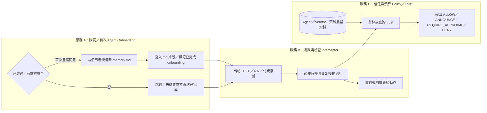

# 三個服務：心智模型 ↔ 程式對照

你用「拆成幾個服務」想的架構很合理；下面先講 **邏輯上的三塊**，再講 **現在 repo 裡對應到哪個資料夾**，以及 **尚未做到的缺口**。

---

## 你預想的三個服務（邏輯邊界）



**白話**

| 服務 | 問的問題 |
|------|-----------|
| **A：Onboarding** | 這個 Agent 有沒有買過／要不要第一次請授權改 md？ |
| **B：Interceptor** | Agent 準備付錢或打付費 API 時，有沒有被擋下來先做檢查？ |
| **C：Trust／Policy** | 這筆交易過不過？信任分數與預算規則是多少？ |

---

## 現在程式對應到哪（同一個 repo，模組扮演「未來可拆出去的服務」）

目前 **不是三台獨立機器**，而是一個 Python 套件 **`core`**，用資料夾把「未來可拆」的邊界先切開：

| 你說的服務 | 現在主要在這裡 | 做什麼 |
|------------|----------------|--------|
| **A：首次購買／授權 md** | [`src/core/integrations/canfly/`](../src/core/integrations/canfly/) | `entitlement`（有沒有買過）、`onboarding`（授權改 md）、`pipeline.run_canfly_agent_gate`（串：**權益 → md 同意 → 要不要開攔截**）。多數仍是 **TODO／占位**。 |
| **B：攔截與檢查** | 同上資料夾的 `interception.py` + 日後 BG HTTP | 「出站前要不要再問 BG」的 **掛勾占位**；真正攔 HTTP／402 多半要在 **Agent runtime／Skill／proxy**，這裡只有介面概念。 |
| **C：信任分數／買賣時查表** | [`src/core/trust/`](../src/core/trust/)（`trust_score.py`、`decision.py`）、[`runtime.py`](../src/core/runtime.py)、[`infra/`](../src/core/infra/)（`data_loader`、`db`） | **每次交易**用 `users.json`／`vendors.json`（與該筆 `transaction`）**現算**分數並裁決；[`infra/db.py`](../src/core/infra/db.py) 主要是 **把結果寫進 SQLite 留紀錄**，**不是**「一直更新的 Agent 信任總表」。 |

入口對照：

- **示範跑一筆交易（穿過 C）**：[`python -m core.main`](README.md) → `main.py` → `runtime.process_transaction`。
- **示範「Canfly 門檻」（A→B 開關）**：`run_canfly_agent_gate`（還沒自動接在 `main` 前面；要接成「先 A 再允許進 B／C」需要你再接一層編排）。

---

## 為什麼你覺得「不夠模組化」：觀念差一個詞

你把 **服務 C** 想成：**背景一直算分，存成一張表，買賣時只查表**。

現在實作比較像：**每次要付費時，用當下的 user／vendor／交易欄位「當場算」**（**request-time 計算**），外加 **SQLite 寫入審計**，**沒有**獨立的「Agent 信任分數表服務」也沒有週期性重算。

所以要模組化成你腦中的 C，還差例如：

- 一層 **`trust_store` / `AgentTrustTable`**（DB 表或 cache），欄位如 `agent_id`、聚合分數、最後更新時間；
- **排程或事件**：交易完成／風控事件後 **更新**那張表；
- `decision` 變成：**先讀表（可選再微調）**，而不是只讀靜態 JSON。

這可以之後獨立成一個 **Trust Registry 服務**，介面例如 `GET /agents/{id}/trust`；現在是 **單體裡的模組**。

---

## 整條使用者路徑（你預想的順序）

1. **Agent 裝服務** → **服務 A**：是否首次／是否同意改 md？否則跳過或擋住。  
2. **Agent 平常行為** → **服務 B**：在「要付錢／遇 402」時攔截，轉去問授權。  
3. **授權／付費決策** → **服務 C**：用信任與預算（未來可查表）回 **ALLOW** 等。

目前 repo：**C 最完整**；**A、B 是 Canfly 子包裡的骨架**；**A→B→C 的「一條龍編排」還沒寫成一個總 orchestrator**（例如單一 `run_agent_payment_flow()`），所以光看資料夾會像「散落各處」。

---

## 若你要目錄長相也一眼像三服務（可選的下一步）

不改行為，只改命名／分資料夾時，可以往這個形狀靠攏（示意）：

```text
src/core/
  integrations/canfly   # 服務 A（購買／md）
  integrations/bgaas    # BG API 占位
  trust/                # 服務 C：trust_score + decision（獨立模組）
  runtime.py              # 編排：載入資料 → trust → infra(db) → infra(notifications)
  infra/                  # 路徑、JSON、SQLite、通知占位
```

若要真的 **三個獨立行程／三個 repo／三個 Docker**，只要把上列邊界的 **import 改成 HTTP／gRPC** 即可；邊界現在是 **邏輯模組**，還不是 **網路服務**。

---

## 相關文件

- 整體目錄說明：[ARCHITECTURE.md](./ARCHITECTURE.md)
- 專案 README：[../README.md](../README.md)
